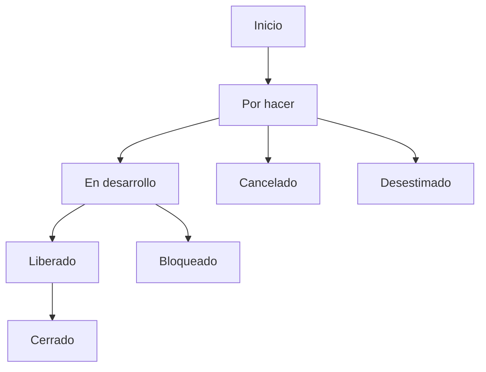

# Flujo PAP Simple

El flujo **PAP Simple** representa las etapas principales y alternas por las que pasa un elemento dentro del proceso.

---

## 🟢 Diagrama principal

---

## 🧩 Descripciones

### Flujo principal
| Estado        | Descripción                    |
|----------------|--------------------------------|
| Inicio         | Inicio del flujo.              |
| Por hacer      | Elemento registrado.           |
| En desarrollo  | Trabajo activo.                |
| Liberado       | Validación previa al cierre.   |
| Cerrado        | Fin del flujo.                 |

### Rutas alternas
| Estado        | Descripción              |
|----------------|--------------------------|
| Cancelado      | Detenido por LT/PO.      |
| Desestimado    | Descartado por el PO.    |
| Bloqueado      | Trabajo detenido.        |

---

> **Nota:** Cada estado puede mostrar información detallada al seleccionarse en la interfaz original del flujo HTML.
